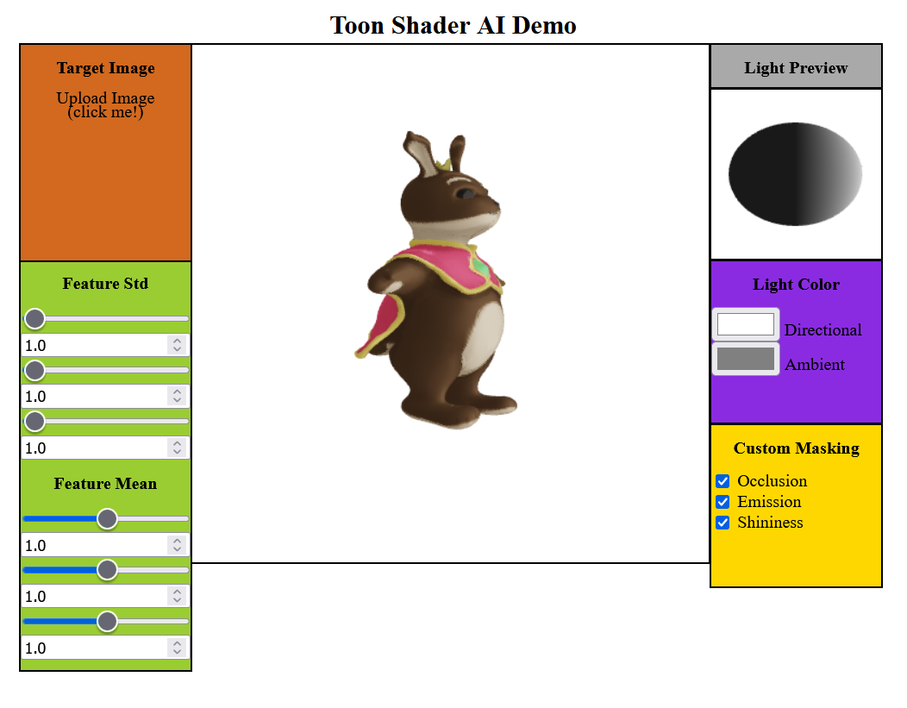
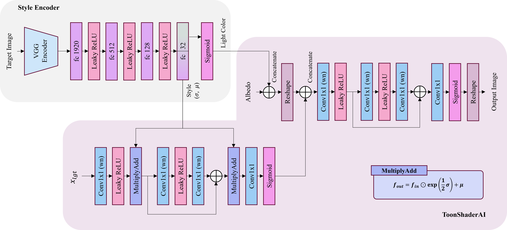

# Toon Shader AI
## Overview
ToonShaderAI is a compact neural network designed to apply toon shading to 3D models in the style of a target image. All of its functions can be implemented as a pixel shader in standard rendering pipelines, except encoding the target image in the style input. To incorporate ToonShaderAI into your rendering pipeline, obtain the style input using the exterior style encoder, and then bind it to ToonShaderAI within the pixel shader. For guidance on usage, please refer to my simple demo webpage and example implementations in major shading languages.
## Demo
Check my simple web demo [here](https://myeongrae.github.io/ToonShaderAI/).


## Usage
### Example Shaders
You can find an example implementation of a pretrained model in GLSL, HLSL and WebGL2 [here](examples/).
### Shader Inputs
To run ToonShaderAI in a pixel shader, several inputs are required.
* view position in world coordinates
* normals in world coordinates
* light position(light direction) in world coordinates
* color of directional light
* color of ambient light
* albedo texture
* occlusion map (custom shadow map)
* emission map (custom highlight map)
* shininess map (It has almost no effect on the results; you can ignore it.)
### Requirements
First, install requirements with the command below.
```
pip install -r requirements.txt
```
### Encode Image
To encode your target image and obtain style and light parameters, run the code as shown below.
```
python encode.py path/to/your/image.png
```  

## Limitations
There are some limitations on The ToonShaderAI.
* only one light source is supported.
* cannot handle different material types (glass, metal, etc.).
* relatively heavy computational costs due to lot of matrix multiplications and sigmoid function.
* shininess has almost no effect on the results.
* no supports outlines.
## License
MIT License
## Model Details
<details>
<summary>only for those interested in it.</summary>

### model structures



There are two main models this project. The exterior style encoder with pretrained VGG-19 and the ToonShaderAI, which is compatible with conventional pixel shaders. The style encoder attempts to encode VGG-19 features into the style input and light colors for the ToonShaderAI. It is implemented using shallow Multilayer Perceptron(MLP).

ToonShaderAI only uses Leaky ReLU, Sigmoid, and Convolutional layer with 1x1 kernel size, which are pixel-wise operators. At first, it finds lighting features from input geometry and light position (direction). To be specific. the lighting input $x_{lgt}$ can be expressed as below.
$$x_{lgt}=concat(\emptyset, L\cdot N, R\cdot V, O, E, S) \in \mathbb{R}^{N\times 6 \times H \times W}$$

* $L$ : Normalized light direction
* $N$ : Normal
* $R = L-2(L\cdot N)N$ : Normalized reflected vector of light
* $V$ : Normalized view direction
* $O$ : Occlusion; Custom shadow
* $E$ : Emission; Custom highlight
* $S$ : Shininess

The function $concat$ indicates concatenation in the channel dimension. Instead of using vectors directly, it utilizes $L\cdot N$ and $R\cdot V$ as diffuse and specular inputs. This approach can reduce model complexity and achieve coordinates invariance. Another point to note is that there is padding on the first channel, as it facilitates easier implementation in other shading languages with just vec3 and mat3.  

The style input is applied after certain layers, mimicking feature reparametrization techniques found in various style transfer models, such as AdaIN([arxiv](https://arxiv.org/abs/1703.06868)). Assuming the output of layer has staticstics with 0 mean and 1 std along spatial dimenstions, it is equivalent to multiplying the std of the feature and adding the mean of feature. Threfore, my style transfer layer simply is multplying and adding the style input. If there is no style input, they become 1 and 0 respectively.
$$ f_{out} = f_{in}\odot \exp( \frac{\sigma}{2} ) +\mu $$ 
$\odot$ indicates hadamard product which is an element-wise product. To ensure the multiplier of the style input (style std) is a positive value, an exponential function is applied to $\sigma$. 

lighting features, albedo input, and light colors (directional and ambient) serve as inputs for the coloring module. The coloring module is applied to each color channels separately. It means R, G, B channels share the same model weights. This approach reduces the model complexity, and prevents gray output. It can be implemented with a simple reshape layer, transforming the input shape from $(N, 3C, H, W)$ to the output shape $(3N, C, H, W)$.

</details>
